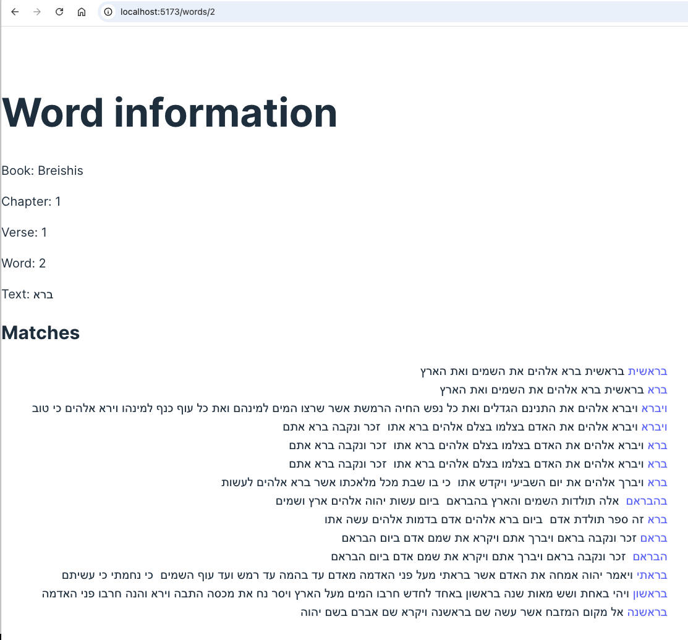

# Tanach Matches Frontend

## Overview

Tanach Matches is a full-stack application that allows users to instantly find all matches for words in the Tanach (Ancient Hebrew Bible), where the word appears at least as part of the "matched word." This frontend of the application is built using React and consumes the APIs provided by the Tanach Matches Backend I built, located at [https://github.com/NGWi/tanach_matches_backend](https://github.com/NGWi/tanach_matches_backend).

A list of planned features for the project can be found at [https://gist.github.com/NGWi/21a69a3a859f619e49eb25dc1c87a725](https://gist.github.com/NGWi/21a69a3a859f619e49eb25dc1c87a725)

## Features

- List all verses in order with their book, chapter, and verse number
- Zoom in on a specific verse to see all its words with their associated data
- Fetch a word and all its connected data
- Retrieve matches for words
- Fetch matched words and their associated verses
- Go directly to verses by chapter and verse number (in development)

## Installation

Prerequisites: npm (or yarn) and [Tanach Matches Backend](https://github.com/NGWi/tanach_matches_backend).

To get started with the Tanach Matches frontend, follow these steps:

1. **Clone the repository:** `git clone https://github.com/NGWi/tanach_matches_frontend.git`
2. **Install dependencies:** `npm install` or `yarn install`
3. **Start the development server:** `npm run dev` or `yarn dev`
4. **Boot up the backend:** From inside its' directory, run `rails server`

## Usage

The frontend provides a user-friendly interface for interacting with the data provided by the Tanach Matches Backend. You can use the application to:

**Browse through the list of verses:** "/verses", or "/" (for now)

**View the details of a specific verse:** Click on Zoom In on the above page. Or, if you know the number of the verse, "/verses/:id", or "/verses/:chapter/:verse" (in development)

**See the matches of a word with the verses they appear in, along with other word details:** Click on the word in the verse page or another word's Matched list. Or if you know the number of the word in your uploaded bible file, "/words/:id"

## Contributing

Contributions are welcome! If you find any bugs or have ideas for new features, please open an issue or submit a pull request.

## License

This project is licensed under the MIT License.
